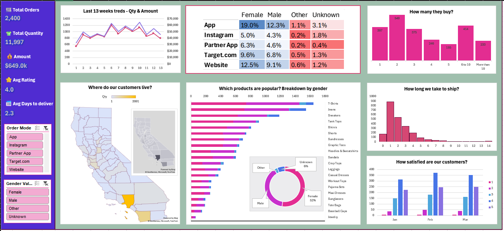

# E-Commerce Sales MIS Dashboard (Excel)

## Overview
Excel-based MIS dashboard summarizing e-commerce sales, orders, customer behavior, and delivery performance for management reporting.

## Dashboard Preview

## Key Metrics Covered
- Total Orders, Quantity, and Revenue
- Weekly Sales & Quantity Trends (Last 13 Weeks)
- Customer Demographics by Order Source
- Product Popularity by Gender
- Purchase Frequency Analysis
- Shipping Time Performance
- Customer Satisfaction Ratings
- Geographic Distribution of Customers

## Tools & Techniques
- MS Excel (Advanced)
- Pivot Tables & Pivot Charts
- Excel Formulas (VLOOKUP/XLOOKUP, IF, SUMIF, COUNTIF)
- Conditional Formatting
- Slicers for interactive filtering

## Purpose
Designed for MIS reporting to enable quick performance tracking and clear, management-ready summaries.
